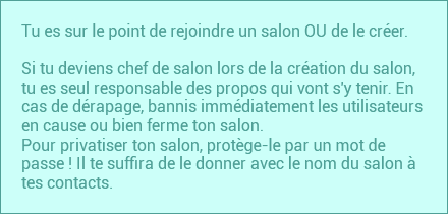
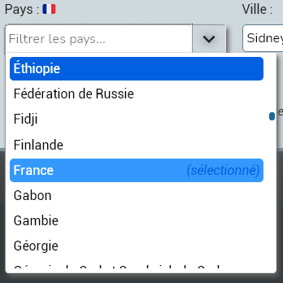
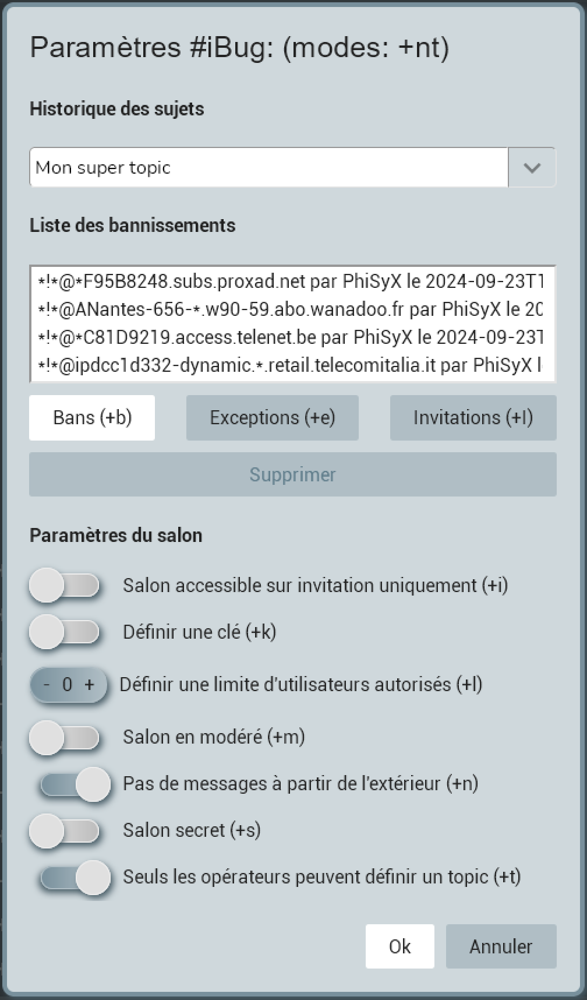

# Flex

**Flex** est un projet qui n'a pas d'objectif spécifique, il vise à développer des applications et des sites web de
manière différente, en utilisant une multitude de langages et une variété de technologies.

**Flex** a été réfléchi pour une architecture / organisation multi-applications et multi-sites.

---

Informations importantes concernant ce projet:

1.  Il a été crée pour le **fun** et dans le but de m'améliorer dans la conception de projets de manière générale.
2.  Il n'a pas vocation d'être **DÉPLOYÉ** pour de la production.
3.  Il n'est pas **STABLE** et ne le sera pas non plus dans le futur.
4.  Il ne se veut pas lié à un écosystème d'un langage précis.
5.  Il PEUT être **abandonné** à tout moment.

Autrement dit, c'est un code en chantier et _non professionnel_. Toutefois le projet se veut suivre une certaine qualité
de code, en suivant les [règles de qualité de code](docs/code-quality/) qui ont été définit par mes propres soins.

---

## Applications de **Flex**:

-   [x] **Chat**

    -   [x] `Flex Discussion` client web avec Vue

        1. Un fichier `apps/web/flex-discussion/.env` DOIT être crée.
        2. Commandes : `pnpm chat:discussion` et `pnpm story:discussion`

-   [x] Serveur (`cargo run --bin flex`)

    1.  Un fichier `config/flex/.env` DOIT être crée. Se referer au fichier
        `config/flex/.env.example`.

    2.  Les fichiers de configuration finissant par `.example.yml` DOIVENT être renommés, sans `.example`.
        Exemple: `chat.example.yml` -> `chat.yml`.

## UI Kit

-   [x] Composant ActionBar

    Un composant `ActionBar` inclut un titre, et des actions. Il fournit une zone standard pour les contrôles d'action. Il permet de définir des contrôles qui peuvent être utilisés de spécifiquement à une vue.

    Notre composant `ActionBar` définit deux zones distinctes :

    1.  **Zone de titre**

    Cette zone contient soit une chaîne de caractères contenant le texte du titre, soit des balises HTML.

    2.  **Zone d'action**

    Cette zone contient des composants qui définissent les actions que l'application peut effectuer dans une vue.

    Par exemple, notre application peut définir un bouton de recherche et/ou d'actualisation dans la zone d'action.

    L'image suivante montre le composant `ActionBar` intégré au composant `PrivateRoom` de l'application avec un avatar ouvre un menu et un bouton de fermeture de privé :

    

-   [x] Composant Alert

    Un composant `Alert` indique une information qu'un utilisateur DOIT lire.

    Un composant `Alert` peut avoir un bouton de fermeture. Il peut également s'auto-détruire si la propriété
    `closeAfterSeconds` lui est donnée.

    Il peut avoir une apparence différence en fonction du thème choisi par l'utilisateur ou celui par défaut de l'application et du niveau d'importance de l'information.

    **Les types d'alertes** :

    1.  `error`
    2.  `info`
    3.  `success`
    4.  `warning`

    L'image suivante montre le composant `Alert` de type `info` sur l'habillage du thème `ice`, intégré au composant
    `ChannelJoinDialog` de l'application :

    

-   [ ] Composant AlertDialog
-   [x] Composant Badge

    L'image suivante montre le composant `Badge`, intégré aux composants `NavigationArea` et `NavigationRoom` de
    l'application :

    
    

-   [x] Composant ComboBox

    Un composant `ComboBox` est simplement un composant `DropDownList` avec un
    champ de filtre.

    L'image suivante montre le composant `ComboBox`, intégré au composant `UpdateAccountDialog` de l'application :

    

-   [ ] Composant DataGrid
-   [x] Composant Dialog

    Un composant `Dialog` permet de créer une [boite de dialogue](https://developer.mozilla.org/fr/docs/Web/HTML/Element/dialog).

    L'image suivante montre le composant `Dialog`, intégré au composant `ChannelSettingsDialog` de l'application :

    

-   [x] Composant DropDownList

    Un composant `DropDownList` est simplement un composant `ComboBox` SANS le
    champ de filtre du composant `ComboBox`. Voir l'image du `ComboBox`.

-   [ ] Composant DropDownMenu

-   [x] Composant FormLink

    Un composant `FormLink` permet de créer un [lien classique](https://developer.mozilla.org/fr/docs/Web/HTML/Element/a)
    sans rediriger l'utilisateur vers l'URL lors du clique.

    Ce composant effectue une requête `XHR` via `fetch` vers l'URL donnée.

-   [x] Composant Image

    Un composant `Image` permet de créer une [image classique](https://developer.mozilla.org/fr/docs/Web/HTML/Element/img)
    avec la possibilité de mettre en cache les appels réseaux côté applicatif.

-   [x] Composant InputCounter
-   [x] Composant InputLabelSWitch
-   [x] Composant InputSWitch
-   [x] Composant Menu
-   [x] Composant MenuItem
-   [x] Composant TextEdit
-   [x] Composant TextInput
