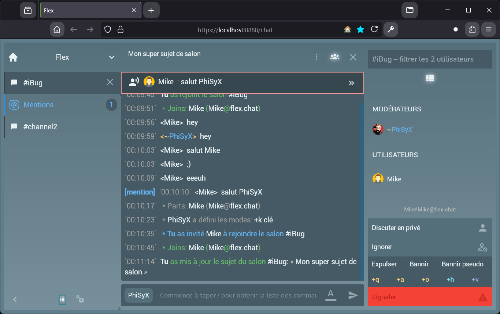
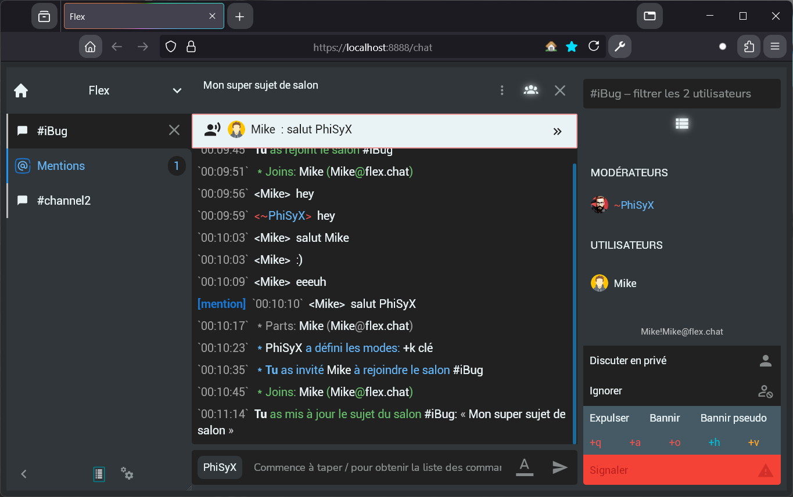
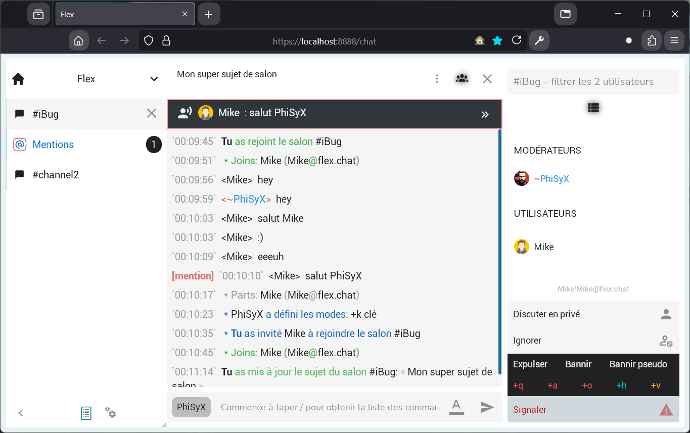
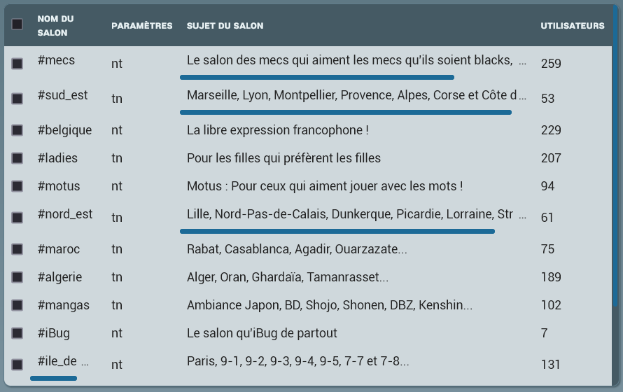
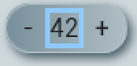
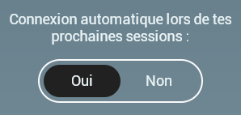
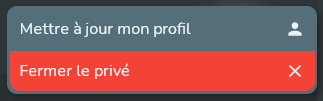

# Flex

**Flex** est un projet qui n'a pas d'objectif spécifique, il vise à développer des applications et des sites web de
manière différente, en utilisant une multitude de langages et une variété de technologies.

**Flex** a été réfléchi pour une architecture / organisation multi-applications et multi-sites.

---

Informations importantes concernant ce projet:

1.  Il a été crée pour le **fun** et dans le but de m'améliorer dans la conception de projets de manière générale.
2.  Il n'a pas vocation d'être **DÉPLOYÉ** pour de la production.
3.  Il n'est pas **STABLE** et ne le sera pas non plus dans le futur.
4.  Il ne se veut pas lié à un écosystème d'un langage précis.
5.  Il PEUT être **abandonné** à tout moment.

Autrement dit, c'est un code en chantier et _non professionnel_. Toutefois le projet se veut suivre une certaine qualité
de code, en suivant les [règles de qualité de code](docs/code-quality/) qui ont été définit par mes propres soins.

---

## Applications de **Flex**:

-   [x] **Chat**

    -   [x] `Flex Discussion` client web avec Vue

        1. Un fichier `apps/web/flex-discussion/.env` DOIT être crée.

-   [x] Serveur

    1.  Un fichier `config/flex/.env` DOIT être crée. Se referrer au fichier
        `config/flex/.env.example`.

    2.  Les fichiers de configuration finissant par `.example.yml` DOIVENT être renommés, sans `.example`.
        Exemple: `chat.example.yml` -> `chat.yml`.

## Prévisualisation du client web

| Ice                                     | Dark                                      | Light                                       |
| --------------------------------------- | ----------------------------------------- | ------------------------------------------- |
|  |  |  |

## Prérequis

-   [Node.js LTS](https://nodejs.org/fr/download)
-   [pnpm](https://pnpm.io/installation) (utilisation des workspace avec)
-   [Rust](https://www.rust-lang.org/fr/)

## Installation des dependences:

```bash
pnpm install
cargo build
```

### Execution des applications

-   **Chat Server**: `cargo run --bin flex`
-   **Flex Discussion Web Client**: `pnpm chat:discussion`
-   **Flex Discussion Storybook**: `pnpm story:discussion`
-   **Adonai Serveur Application**: `pnpm adonai`

## Informations des tests

### Test avec JavaScript/TypeScript

#### Test Unitaire

**Flex** utilise [Vitest](https://vitest.dev/) pour tester unitairement le code JavaScript/TypeScript.

1. **Exécution des tests unitaires**:

```bash
# Démarrer tous les tests unitaires de tous les packages
pnpm test:unit

# Démarrer tous les tests unitaires d'un package spécifique
pnpm --filter @phisyx/flex-<package-name> test:unit
```

2. **Écrire un test unitaire**:

    - Placer les fichiers de test dans un répertoire `tests` au sein du package
    - Nommer les fichiers de test avec une extension `.spec.ts`

    Exemple:

    ```typescript
    import { it } from "vitest";
    import { myFunction } from "#src/myFile";

    it("myFunction: test case description", ({ expect }) => {
    	expect(myFunction(input)).toEqual(expectedOutput);
    });
    ```

#### End-to-End Testing

**Flex** utilise [Playwright](https://playwright.dev/) pour les tests end-to-end de l'application web **Flex Discussion**.

1. **Exécution des tests E2E**:

    ```bash
    # Démarrer tous les tests e2e
    pnpm test:e2e
    # Afficher le report
    pnpm test:e2e:report
    ```

2. **Écrire un test E2E**:

    - Placer les fichiers de test dans un répertoire `tests/e2e` au sein du package
    - Nommer les fichiers de test avec une extension `.spec.ts`
    - Utiliser la classe utilitaire `ChatPageContext` pour simplifier les opérations communes

    Exemple:

    ```typescript
    import { test } from "@playwright/test";
    import { ChatPageContext } from "./helpers/context.js";

    test("Test description", async ({ page }) => {
    	let chat_ctx = await ChatPageContext.connect(page);
    	// Test actions and assertions
    });
    ```

### Test avec Rust

1. **Exécution des tests Rust**:

    ```bash
    # Lancer tous les tests
    cargo test

    # Lancer tous les tests d'un package spécifiqu
    cargo test -p flex-package-name
    ```

2. **Écrire un test Rust**:

    - Placer les fichiers de test dans un répertoire `tests` au sein du package ou directement dans un module avec
      `#[cfg(test)]`

    Exemple:

    ```rust
    #[test]
    fn test_function_name() {
        let result = function_to_test();
        assert_eq!(result, expected_value);
    }
    ```

## Structure du project

Architecture, organisation, structure **minimale** d'un projet multi
applications / sites.

Les fichiers inclus dans les différents répertoires ne sont là qu'à titre
d'exemples. Les applications et les sites ne sont donc pas fonctionnel(le)s.

Il n'y a pas de fichiers permettant de lier les workspaces, à la racine de ce
dépôt, cela est volontaire.

| Dossier                                    | Proposition                                                                                   | Informations complémentaires                                                  |
| ------------------------------------------ | --------------------------------------------------------------------------------------------- | ----------------------------------------------------------------------------- |
| apps/                                      | Toutes les applications liées à notre projet                                                  |                                                                               |
| apps/{app}/                                | Application                                                                                   |                                                                               |
| apps/{app}/assets/                         | Ressources statiques d'une application                                                        | Ressources bien spécifiques à l'application.                                  |
| apps/{app}/bin/                            | Différents points d'entrées d'une app                                                         | (system)                                                                      |
| apps/{app}/entrypoints/                    | Différents points d'entrées d'une app                                                         | (front)                                                                       |
| apps/{app}/src/                            | Fichier source, code métier                                                                   |                                                                               |
| apps/{app}/sys/                            | Design système de l'application                                                               | EX: `storybook`, `histoire`, ... -- À décider (avec `/design`).               |
| apps/{app}/types/                          | Déclarations de types                                                                         | Pour TypeScript, par exemple. EX: `types/file.d.ts`                           |
| apps/{app}/{dir}/                          |                                                                                               |                                                                               |
| apps/{app}/app.{ext}                       | Point d'entrée de l'application (lib)                                                         | EX: `app.ts, app.rs, app.php`, ...                                            |
| apps/{app}/`{pollution-file}`              |                                                                                               | EX: `.gitignore`, `.eslint`, `biome.json`, `clippy.toml`, `phpstan.neon`, ... |
|                                            |                                                                                               |                                                                               |
| assets/                                    | Ressources statiques partagées des applications                                               |                                                                               |
| assets/{dir}/{file}                        |                                                                                               | EX: `audio/file.mp3`, `img/file.png`, `svg/icon.svg`, ...                     |
|                                            |                                                                                               |                                                                               |
| audits/                                    | Audits, pen testing, review, rapports de sécurité                                             |                                                                               |
| audits/{file,script,dir/}                  |                                                                                               |                                                                               |
| audits/{timestamp}/{file}                  |                                                                                               | EX `timestamp`: YYYYMMDD                                                      |
|                                            |                                                                                               |                                                                               |
| config/                                    | Configurations des applications                                                               |                                                                               |
| config/shared                              | Contient les fichiers de configurations applicatifs partagées                                 | EX: certificats ssl, ...                                                      |
| config/{app}/{app}.{ext}                   | Configuration principale d'une application                                                    | EX: fichier brut, schémas/validation, ...                                     |
| config/{app}/{name}.{ext}                  | Configurations secondaires d'une application                                                  |                                                                               |
|                                            |                                                                                               |                                                                               |
| database/                                  | Base de données des applications                                                              |                                                                               |
| database/{sgbd}/                           | Optionnel                                                                                     | EX: `mysql`, `pgsql`, ...                                                     |
| database/{sgbd}/{dir}/                     |                                                                                               | EX: `extensions`, `enums`, `migrations`, `seeders`, `fixtures`, ...           |
|                                            |                                                                                               |                                                                               |
| design/                                    | Design des applications                                                                       | À décider (avec `/apps/{app}/sys`)                                            |
| design/system/                             | Design système des applications (storybook, histoire, ...)                                    | EX: `storybook`, `histoire`, ... -- À décider (avec `/apps/{app}/sys`).       |
| design/{file}                              | Fichiers reliés au Design système des applications                                            | EX: `figjam`, ...                                                             |
|                                            |                                                                                               |                                                                               |
| docs/                                      | Documentation du projet                                                                       |                                                                               |
| docs/adr/                                  | Architecture Decision Record                                                                  |                                                                               |
| docs/apps/{app}/README.md                  | Documentation d'une application                                                               |                                                                               |
| docs/code-quality/                         | Qualité du code                                                                               |                                                                               |
| docs/developers/                           | DX                                                                                            |                                                                               |
| docs/protocols/                            | Protocoles utilisé(e)s                                                                        |                                                                               |
| docs/screenshots/                          | Captures d'écrans                                                                             |                                                                               |
| docs/specs/                                | Spécifications utilisé(e)s                                                                    |                                                                               |
|                                            |                                                                                               |                                                                               |
| env/                                       | Variables d'environnement des applications                                                    |                                                                               |
| env/{app}/{env-file}                       |                                                                                               | EX: `editor/.env`, `editor/.env.local`, `mail/.env.vault`, ...                |
|                                            |                                                                                               |                                                                               |
| i18n/                                      | Internationalisation, locales                                                                 | EX: `fr.po`, `fr.yaml`, ... -- À décider (avec `/locales`)                    |
| locales/                                   | Internationalisation, locales                                                                 | EX: `fr.po`, `fr.yaml`, ... -- À décider (avec `/i18n`)                       |
|                                            |                                                                                               |                                                                               |
| infra/                                     | Containérisation, orchestrateur, CI/CD, Déploiement, configurations toolings, monitoring, ... |                                                                               |
| infra/{tool}/{conf-file}                   |                                                                                               | EX: `Docker`, `k8s`, `Ansible`, ...                                           |
|                                            |                                                                                               |
| libs/                                      | Code partagé par nos applications                                                             |                                                                               |
| libs/patches/{module}/                     | Correctifs de certaines dépendances externes                                                  |                                                                               |
| libs/thirdparty/{module}/                  | Dépendances externes                                                                          | Projets non versionnés, non disponible dans les registres des PM              |
| libs/{manager}/{module}/                   | Les modules internes en fonction de l'écosystème                                              | EX `manager`: `npm`, `composer`, `crates`, `gems`, ...                        |
| libs/{manager}/{module}/examples/          | Les exemples du module                                                                        |                                                                               |
| libs/{manager}/{module}/src/               | Fichiers sources                                                                              |                                                                               |
| libs/{manager}/{module}/{dir}/             |                                                                                               |                                                                               |
| libs/{manager}/{module}/`{pollution-file}` |                                                                                               | EX: `.gitignore`, `.eslint`, `package.json`, `Cargo.toml`, ...                |
| libs/{manager}/{module}/{index}.{ext}      | Un fichier qui sert d'index pour éviter de faire des imports sur `src/`                       | EX: `index.ts`, `lib.rs`, ...                                                 |
|                                            |                                                                                               |
| licenses/                                  | Fichiers de licences                                                                          |                                                                               |
| licenses/{license-file}                    |                                                                                               | EX: `LICENSE-MIT`, `MPL-2.0.LICENSE`, `Apache-2.0.txt`, ...                   |
|                                            |                                                                                               |                                                                               |
| supports/                                  | Communications, discussions internes                                                          | EX: `pdf`, `markdown`, ...                                                    |
|                                            |                                                                                               |                                                                               |
| tests/                                     | Les tests fonctionnels des applications                                                       |                                                                               |
| tests/{app}/                               |                                                                                               |                                                                               |
|                                            |                                                                                               |                                                                               |
| tmp/                                       | Les fichiers temporaires générés par les applications                                         |                                                                               |
| tmp/{dir}/                                 |                                                                                               | EX: `logs/*`, `pids/*`, `sessions/*`, ...                                     |
|                                            |                                                                                               |                                                                               |
| tools/                                     | Outils internes pour améliorer la DX                                                          |                                                                               |
| tools/{script}                             |                                                                                               | EX: `check-license.sh`, `generate-docs.sh`, ...                               |
| tools/{tooling}/                           |                                                                                               | EX: `git/hooks/*`, `ia/*`, `vscode/*`, ...                                    |
|                                            |                                                                                               |                                                                               |
| www/                                       | Sites webs                                                                                    |                                                                               |
| www/{site}/                                | Site web                                                                                      |                                                                               |
| www/{site}/bin/                            | Différents points d'entrées d'un site                                                         |                                                                               |
| www/{site}/public/                         | Ressources publiques du site                                                                  |                                                                               |
| www/{site}/src/                            | Fichier source, code métier                                                                   |                                                                               |
| www/{site}/site.{ext}                      | Point d'entrée du site (lib)                                                                  |                                                                               |
| www/{site}/`{pollution-file}`              |                                                                                               | EX: `.gitignore`, `.eslint`, `package.json`, `Cargo.toml`, ...                |

## UI Kit

-   [x] Composant ActionBar

    Un composant `ActionBar` inclut un titre, et des actions. Il fournit une zone standard pour les contrôles d'action. Il permet de définir des contrôles qui peuvent être utilisés de spécifiquement à une vue.

    Notre composant `ActionBar` définit deux zones distinctes :

    1.  **Zone de titre**

    Cette zone contient soit une chaîne de caractères contenant le texte du titre, soit des balises HTML.

    2.  **Zone d'action**

    Cette zone contient des composants qui définissent les actions que l'application peut effectuer dans une vue.

    Par exemple, notre application peut définir un bouton de recherche et/ou d'actualisation dans la zone d'action.

    L'image suivante montre le composant `ActionBar` intégré au composant `PrivateRoom` de l'application avec un avatar ouvre un menu et un bouton de fermeture de privé :

    

-   [x] Composant Alert

    Un composant `Alert` indique une information qu'un utilisateur DOIT lire.

    Un composant `Alert` peut avoir un bouton de fermeture. Il peut également s'auto-détruire si la propriété
    `closeAfterSeconds` lui est donnée.

    Il peut avoir une apparence différence en fonction du thème choisi par l'utilisateur ou celui par défaut de l'application et du niveau d'importance de l'information.

    **Les types d'alertes** :

    1.  `error`
    2.  `info`
    3.  `success`
    4.  `warning`

    L'image suivante montre le composant `Alert` de type `info` sur l'habillage du thème `ice`, intégré au composant
    `ChannelJoinDialog` de l'application :

    

-   [ ] Composant AlertDialog
-   [x] Composant Badge

    L'image suivante montre le composant `Badge`, intégré aux composants `NavigationArea` et `NavigationRoom` de
    l'application :

    
    

-   [x] Composant Button

    Un composant `Button` permet de créer un bouton transparent de la manière d'un élément
    [`<button>`](https://developer.mozilla.org/fr/docs/Web/HTML/Element/button)

-   [x] Composant ComboBox

    Un composant `ComboBox` est simplement un composant `DropDownList` avec un
    champ de filtre.

    L'image suivante montre le composant `ComboBox`, intégré au composant `UpdateAccountDialog` de l'application :

    

-   [x] Composant DataGrid

    Un composant `DataGrid` permet de lister des données sous forme de tableau de manière automatique.

    L'image suivante montre le composant `DataGrid`, intégré au composant `CustomRoomChannelList` de l'application :

    

-   [x] Composant Dialog

    Un composant `Dialog` permet de créer une [boite de dialogue](https://developer.mozilla.org/fr/docs/Web/HTML/Element/dialog).

    L'image suivante montre le composant `Dialog`, intégré au composant `ChannelSettingsDialog` de l'application :

    

-   [x] Composant DropDownList

    Un composant `DropDownList` est simplement un composant `ComboBox` SANS le
    champ de filtre du composant `ComboBox`. Voir l'image du `ComboBox`.

-   [ ] Composant DropDownMenu

-   [x] Composant FormLink

    Un composant `FormLink` permet de créer un [lien classique](https://developer.mozilla.org/fr/docs/Web/HTML/Element/a)
    sans rediriger l'utilisateur vers l'URL lors du clique.

    Ce composant effectue une requête `XHR` via `fetch` vers l'URL donnée.

-   [x] Composant Image

    Un composant `Image` permet de créer une [image classique](https://developer.mozilla.org/fr/docs/Web/HTML/Element/img)
    avec la possibilité de mettre en cache les appels réseaux côté applicatif.

-   [x] Composant InputCounter

    Un composant `InputCounter` permet de créer un compteur sur un bouton.

    L'image suivante montre le composant `InputCounter`, intégré au composant `ChannelSettingsDialog` de l'application :

    

-   [x] Composant InputLabelSWitch

    Un composant `InputLabelSWitch` donne deux choix à l'utilisateur, activé ou désactivé.

    1.  Activé labellisé par défaut sous "Oui".
    2.  Désactivé labellisé par défaut sous "Non".

    L'image suivante montre le composant `InputLabelSWitch`, intégré au composant `DirectAccessView` de l'application :

    

-   [x] Composant InputSWitch

    Un composant `InputSWitch` donne deux choix à l'utilisateur, activé ou désactivé.

    L'image suivante montre le composant `InputSWitch`, intégré au composant `DirectAccessView` de l'application :

    

-   [x] Composant Menu

    Un composant `Menu` permet de créer un [menu classique](https://developer.mozilla.org/fr/docs/Web/HTML/Element/menu).

    

-   [x] Composant TextEdit

    Un composant `TextEdit` est semblable à un comportement d'un élément avec `contenteditable`.

-   [x] Composant TextInput

    Un composant `TextInput` permet de créer un champ de saisie de la manière d'un élément
    [`<input>`](https://developer.mozilla.org/fr/docs/Web/HTML/Element/input)
